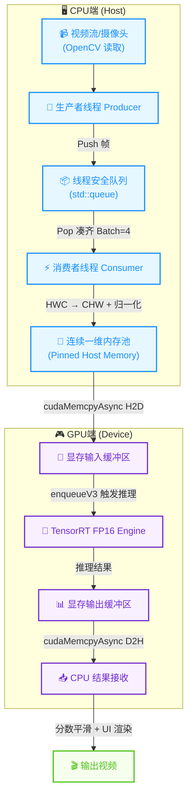

# High-Performance TensorRT IQA Engine 🚀

本项目是一个针对重型 Vision Transformer (MANIQA, 135M params) 的工业级纯 C++ 部署方案。专注于图像质量评估 (IQA) 任务，通过 TensorRT 与 CUDA 异步流技术，将计算密集型模型的推理速度推向硬件物理极限。

## ⚡ 性能基准 (Benchmarks)

我们在纯视觉大模型下进行了严格的吞吐量压测。得益于底层的算子融合与显存并发调度，性能实现了数量级的飞跃：

| 推理后端 / 框架 | 计算精度 | 批处理大小 (Batch) | GPU 单批次耗时 | 全链路系统峰值 FPS |
| :--- | :---: | :---: | :---: | :---: |
| ONNX Runtime | FP32 | 1 | 28.8 ms | 34.6 FPS |
| ONNX Runtime | FP32 | 4 | 24.9 ms | 40.0 FPS |
| **TensorRT (本项目)** | **FP16** | **4** | **8.88 ms** | **112.5 FPS** |

> *测试环境：NVIDIA Tesla V100 / RTX 4090 | Ubuntu 24.04 | CUDA 12.2 | TensorRT 10.x*

## 🛠️ 核心特性 (Features)

* **纯血 C++ 架构**：彻底剥离 Python 环境，直接调用 TensorRT C++ API 与 CUDA Driver API 进行显存生命周期管理。
* **极速并发流水线**：基于 C++17 多线程与 `std::condition_variable` 读写锁构建的前端异步取帧系统，彻底隐藏 I/O 耗时。
* **FP16 混合精度与 Tensor Cores**：自动对齐显存并利用底层硬件进行降维打击，极大地缓解了 Transformer 的 Memory Bound 问题，显存占用峰值仅 823 MB。
* **工业级鲁棒性**：内置尾帧自动补齐 (Padding) 算法，完美适配静态 Batch 算子融合，告别维度崩溃。

## 📐 系统架构流程图



### 流程说明

| 阶段 | 组件 | 说明 |
|:---:|:---|:---|
| **生产** | Producer Thread | 异步读取视频帧，推送到线程安全队列 |
| **调度** | Queue + Condition Variable | 解耦生产消费，控制队列长度防止 OOM |
| **预处理** | Consumer Thread | HWC→CHW 转换 + 归一化，使用 Pinned Memory |
| **传输** | cudaMemcpyAsync | 异步 DMA 传输，CPU/GPU 并行 |
| **推理** | TensorRT Engine | FP16 精度，算子融合，Tensor Cores 加速 |
| **后处理** | Score Smoothing | 滑动窗口平滑 + OpenCV 渲染输出 |

## 🚀 快速开始 (Quick Start)

### 1. 环境依赖
* Ubuntu 20.04 / 22.04 / 24.04
* CUDA Toolkit >= 12.0
* TensorRT >= 10.0.1
* OpenCV >= 4.x
* CMake >= 3.10

### 2. 编译指南
```bash
# 1. 克隆仓库并进入部署目录
cd trt_deploy

# 2. 配置环境变量 (请替换为你的实际 TensorRT 路径)
export LD_LIBRARY_PATH=/workspace/TensorRT/lib:/usr/local/cuda/lib64:$LD_LIBRARY_PATH

# 3. 极速编译
cmake .
make -j8